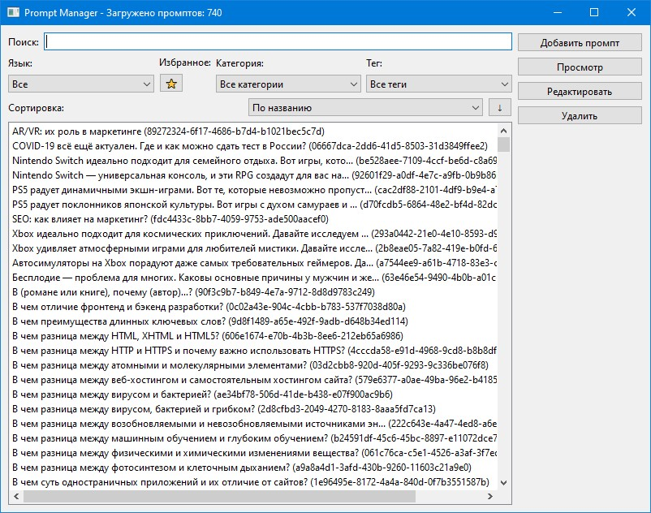
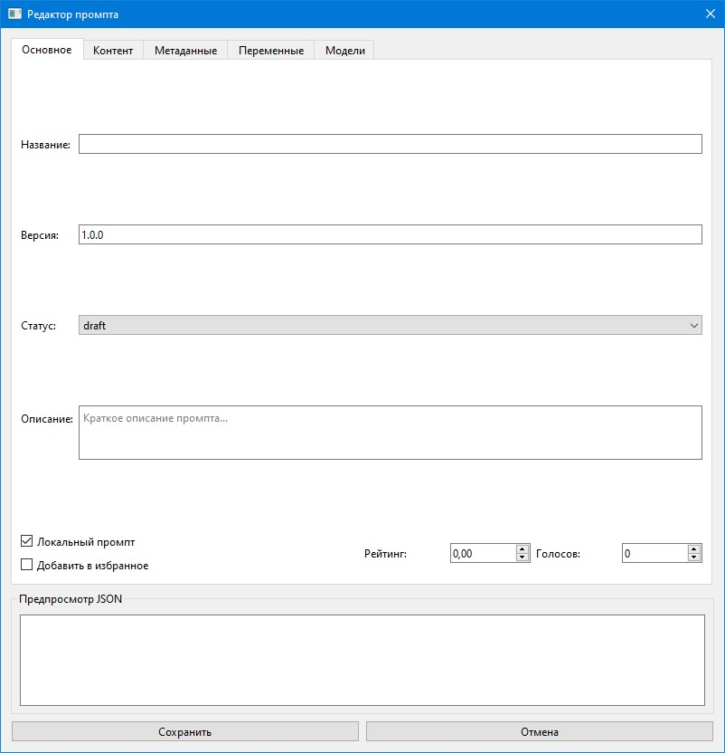
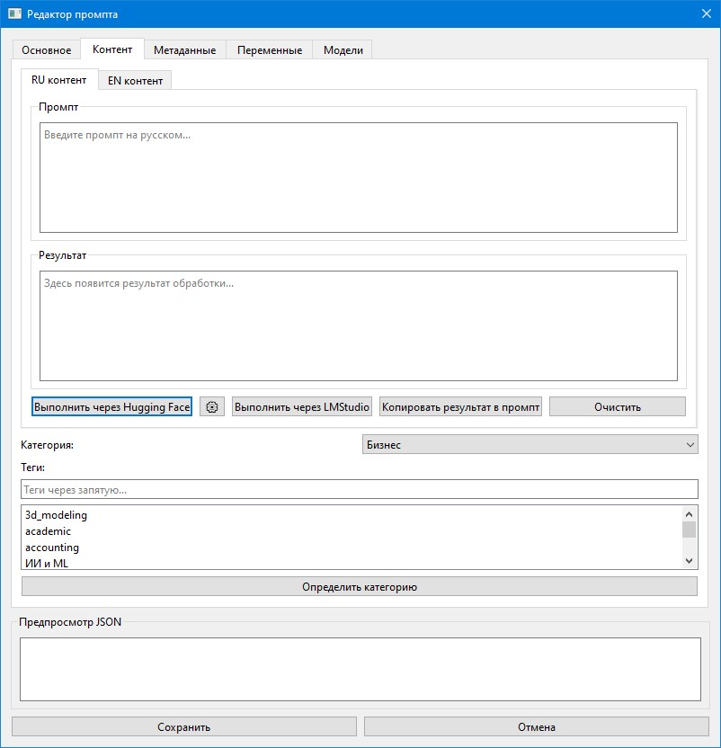
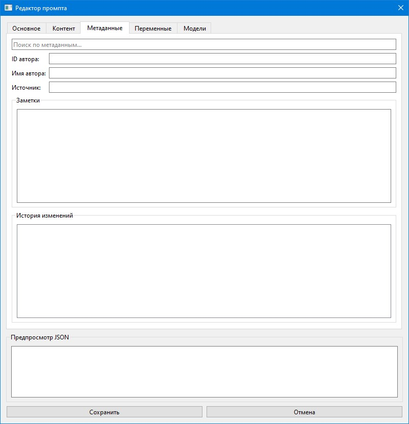
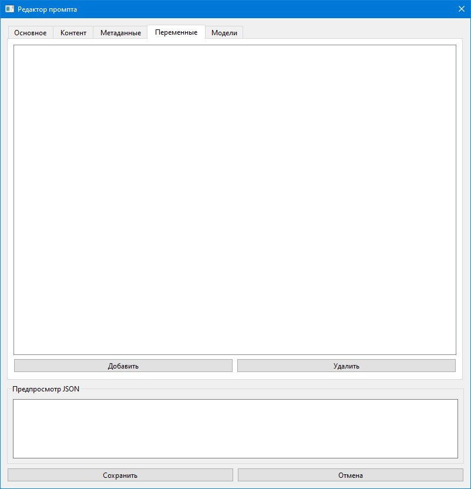
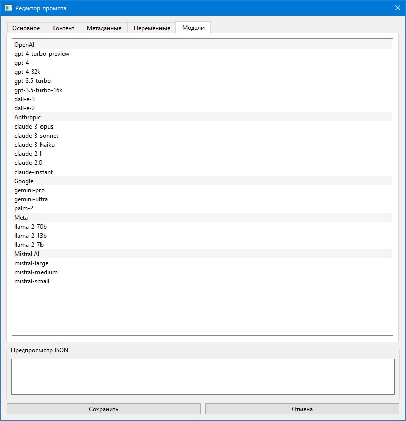
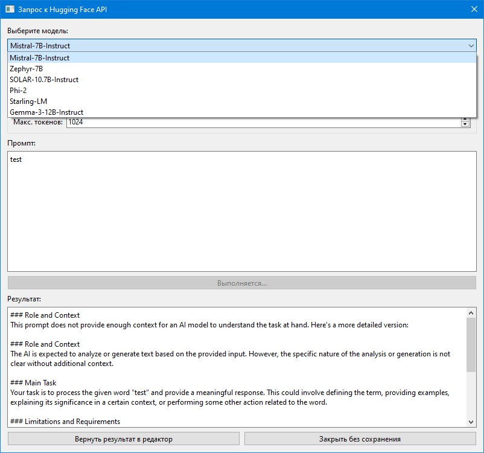

# 📚 Prompt Library

Репозиторий для централизованного хранения, организации и совместной работы над промптами, используемыми в:
- Чат-ботах
- Генеративных моделях (AI Art, текст)
- NLP-задачах (классификация, анализа тональности)
- Обработке данных

---
# 📚 Библиотека Промптов (Prompt Library)

## Назначение 🎯
- **🔄 Версионирование**  
  Контроль изменений и история обновлений промптов
- **🗂️ Категоризация**  
  Четкая структура для быстрого поиска
- **🤖 Интеграция**  
  Готовые шаблоны для подключения к Python-приложениям
- **🌐 Коллаборация**  
  Улучшение промптов сообществом через Pull Requests
  Это централизованный репозиторий для хранения, организации и совместного улучшения промптов для различных AI-систем. Цель проекта — создать структурированную и удобную коллекцию готовых решений для разработчиков, исследователей и энтузиастов.

---

## Структура репозитория 📂
*Будет уточняться*
```
├── general/ # Общее / General
├── marketing/ # Маркетинг / Marketing
├── technology/ # Технологии / Technology
├── creative/ # Творчество / Creative
├── business/ # Бизнес / Business
├── education/ # Образование / Education
├── healthcare/ # Здравоохранение / Healthcare
├── legal/ # Юридическое / Legal
├── entertainment/ # Развлечения / Entertainment
├── common_tasks/ # Общие задачи / Common Tasks
├── science/ # Наука / Science
├── model_specific/ # Специфичные модели / Model-Specific
└── environment/ # Окружающая среда / Environment
```

## Категории и теги 🏷️

*Будут уточняться*
## 🎯 Назначение

*Теги сформированы из дочерних категорий в структуре.*
<details>
  <summary>Все возможные категрии и их теги</summary>

### **General / Общее**
**Теги**:  
`common_tasks`, `education`, `entertainment`, `legal`, `healthcare`
-   **📖 Централизованное хранилище:** Все промпты находятся в одном месте, что упрощает их поиск и использование.
-   **🗂️ Четкая структура:** Промпты организованы по категориям для быстрой навигации.
-   **🤝 Совместная работа:** Любой желающий может предложить улучшения или добавить новые промпты через Pull Requests.
-   **Готовые решения:** Коллекция содержит готовые к использованию промпты для широкого круга задач: от маркетинга и разработки до творчества и образования.

---

### **Marketing / Маркетинг**
**Теги**:  
`social_media`, `seo`, `content_marketing`, `advertising`, `branding`

---
## 🛠️ Как использовать

### **Technology / Технологии**
**Теги**:  
`software`, `data_science`, `ai_ml`, `cloud`, `cybersecurity`, `programming`, `data_analysis`
1.  Перейдите в папку с интересующей вас категорией (например, `creative/` или `technology/`).
2.  Выберите файл с промптом, который соответствует вашей задаче.
3.  Скопируйте текст промпта и используйте его в нужном вам инструменте (ChatGPT, Midjourney, Claude, API вызовы и т.д.).

---

### **Creative / Творчество**
**Теги**:  
`design`, `writing`, `art`, `music`, `video`, `game_dev`
## 📂 Структура репозитория

Репозиторий имеет иерархическую структуру. Каждая папка верхнего уровня представляет собой основную категорию.
```
├── business/ # Бизнес 
├── common_tasks/ # Общие задачи 
├── creative/ # Творчество 
├── education/ # Образование 
├── entertainment/ # Развлечения 
├── environment/ # Окружающая среда 
├── general/ # Общее 
├── healthcare/ # Здравоохранение 
├── legal/ # Юридическое 
├── marketing/ # Маркетинг 
├── model_specific/ # Специфичные для моделей 
├── science/ # Наука 
└── technology/ # Технологии
```
---

### **Business / Бизнес**
**Теги**:  
`finance`, `hr`, `project_management`, `sales`, `customer_service`
## 🏷️ Категории и теги

---

### **Education / Образование**
**Теги**:  
`courses`, `research`, `language_learning`, `testing`

---

### **Healthcare / Здравоохранение**
**Теги**:  
`diagnostics`, `patient_care`, `medical_research`

---

### **Legal / Юридическое**
**Теги**:  
`contracts`, `regulations`, `dispute_resolution`

---

### **Entertainment / Развлечения**
**Теги**:  
`games`, `music`, `movies`, `books`

---

### **Social Media / Соцсети**
**Теги**:  
`instagram`, `facebook`, `tiktok`

---

### **SEO**
**Теги**:  
`keyword_optimization`, `content_strategy`

---

### **AI/ML / ИИ и ML**
**Теги**:  
`nlp`, `computer_vision`, `reinforcement_learning`

---

### **Software / Программное обеспечение**
**Теги**:  
`dev_ops`, `web_dev`, `mobile_dev`

---

### **Design / Дизайн**
**Теги**:  
`uiux`, `graphic_design`, `3d_modeling`

---

### **Writing / Письмо**
**Теги**:  
`fiction`, `academic`, `technical`

---

### **Finance / Финансы**
**Теги**:  
`investment`, `accounting`, `risk_management`

---

### **HR**
**Теги**:  
`recruitment`, `training`, `performance`

---

### **Diagnostics / Диагностика**
**Теги**:  
`medical_imaging`, `symptom_analysis`

---

### **Courses / Курсы**
**Теги**:  
`programming`, `mathematics`, `languages`

---

### **Games / Игры**
**Теги**:  
`strategy`, `puzzle`, `casual`

---

### **Music / Музыка**
**Теги**:  
`composition`, `production`, `analysis`

---

### **Common Tasks / Общие задачи**
**Теги**:  
`productivity`, `translations`, `automation`

---

### **Science / Наука**
**Теги**:  
`physics`, `chemistry`, `biology`

---

### **Model-Specific / Специфичные модели**
**Теги**:  
`gpt-4`, `dalle`, `stable_diffusion`, `midjourney`

---

### **Programming / Программирование**
**Теги**:  
`python`, `javascript`, `data_structures`

---

### **Data Analysis / Анализ данных**
**Теги**:  
`statistics`, `big_data`, `visualization`

---

### **Environment / Окружающая среда**
**Теги**:  
`climate`, `energy`, `conservation`

---

### **Game Development / Разработка игр**
**Теги**:  
`game_design`, `asset_creation`, `level_design`

</details>

---

### Управление API ключами 🔑
Для использования некоторых функций требуются API ключи:

1. **Добавление ключа**:
  - В редакторе промптов нажмите кнопку ⚙️ рядом с кнопкой Hugging Face
  - В появившемся окне введите ваш API ключ
  - Нажмите "Сохранить"

2. **Безопасность**:
  - Ключи хранятся в зашифрованном виде локально и никуда не передаются
  - Используется алгоритм AES-GCM для шифрования
  - Файлы с ключами имеют ограниченные права доступа

---

## Скриншоты 📸
-   **Категории:** Названия папок верхнего уровня (`marketing`, `technology` и т.д.) являются основными категориями.
-   **Теги:** Вложенные папки (например, `technology/programming/`) можно рассматривать как теги для более точной классификации. Мы рекомендуем использовать эту структуру для навигации.

<details>
  <summary>Скриншоты проекта</summary>
  <summary>Посмотреть примеры категорий и подкатегорий (тегов)</summary>


_Виджет с поиском, списком промптов и кнопками действий_






- **Technology / Технологии**
  - `software`
  - `data_science`
  - `ai_ml`
  - `programming`
- **Creative / Творчество**
  - `design`
  - `writing`
  - `art`
  - `game_dev`
- **Business / Бизнес**
  - `finance`
  - `hr`
  - `project_management`

</details>

---

## Как использовать 🛠️
Проект будет использоваться для [aipromptmaster]( https://github.com/arnyigor/aipromptmaster)

---

## Сборка приложения
## 🤝 Участие в проекте

### Windows
Для сборки приложения используется Auto Py to Exe. Конфигурация сборки находится в файле `auto-py-to-exe-config.json`.
Мы приветствуем ваш вклад в развитие библиотеки! Вы можете помочь, добавляя новые промпты или улучшая существующие.

1. Установите зависимости:
```bash
pip install -r requirements.txt
pip install auto-py-to-exe
```
**Как добавить промпт:**

2. MAC Соберите **.app**:
   ```bash
   pyinstaller --onefile --windowed --name "aipromptmaster" src/main.py --distpath .
1.  Сделайте форк репозитория.
2.  Создайте новую ветку для ваших изменений (`git checkout -b feature/add-new-prompt`).
3.  Добавьте ваш промпт в соответствующую папку. Если нужной категории нет, вы можете ее предложить.
4.  Сделайте коммит и отправьте изменения в ваш форк (`git push origin feature/add-new-prompt`).
5.  Создайте Pull Request в этот репозиторий с описанием вашего вклада.

2. Запустите Auto Py to Exe:
```bash
auto-py-to-exe
```
**Требования к промптам:**

3. Импортируйте конфигурацию из файла `auto-py-to-exe-config.json`
-   **Ясность:** Промпт должен быть понятным и четко сформулированным.
-   **Контекст:** Желательно добавить краткое описание, для какой задачи или модели предназначен промпт.
-   **Структура:** Размещайте промпт в наиболее подходящей категории.

4. Нажмите кнопку "Convert .py to .exe"
---

### macOS
1. Установите зависимости:
```bash
pip install -r requirements.txt
pip install pyinstaller
```
## 🔗 Связанные проекты

2. Соберите приложение:
```bash
pyinstaller --clean --windowed \
            --name "aipromptmaster" \
            --distpath . \
            src/main.py
```

3. Запустите приложение двойным кликом по `aipromptmaster.app`

Примечание: папка `prompts` создастся автоматически при первом запуске приложения.
-   [**AiPromptMaster**](https://github.com/arnyigor/aipromptmaster) — десктопное приложение, которое использует эту библиотеку для управления промптами.

---

## **Участие в проекте** 🤝
Приветствуются улучшения через:
1. Issues (предложения новых категорий/исправлений)
2. Pull Requests (добавление промптов)
3. Обсуждения в Discussions
## ⚖️ Лицензия

---
Проект распространяется под лицензией **CC BY-SA 4.0**. Это означает, что вы можете свободно использовать, изменять и распространять материалы с указанием авторства и сохранением этой же лицензии.

**Требования к промптам**:
- Четкая структура
- Указание контекста использования
- Теги для поиска (например: #translation #marketing)
## ✉️ Контакты

Лицензия ⚖️
CC BY-SA 4.0 - Свободное использование с указанием авторства и сохранением лицензии.
-   **Автор:** [arnyigor](https://github.com/arnyigor)
-   **Telegram:** [@arnyigor](https://t.me/arnyigor)

## Контакты
Автор: [arnyigor](https://github.com/arnyigor)
Контакты:[Telegram](https://t.me/arnyigor)
Последнее обновление: 09-03-2025
*Последнее обновление: 17-07-2025*

